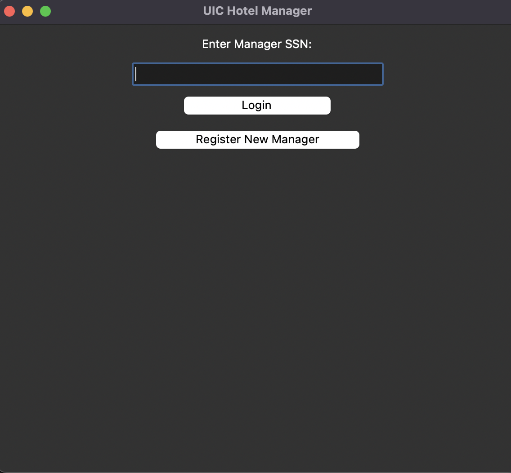
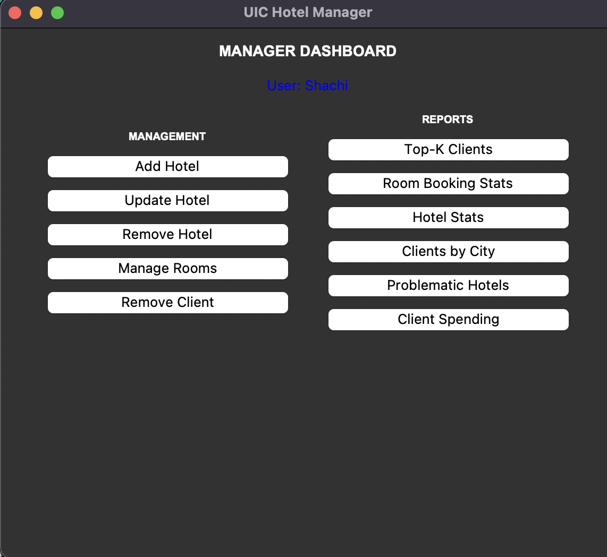
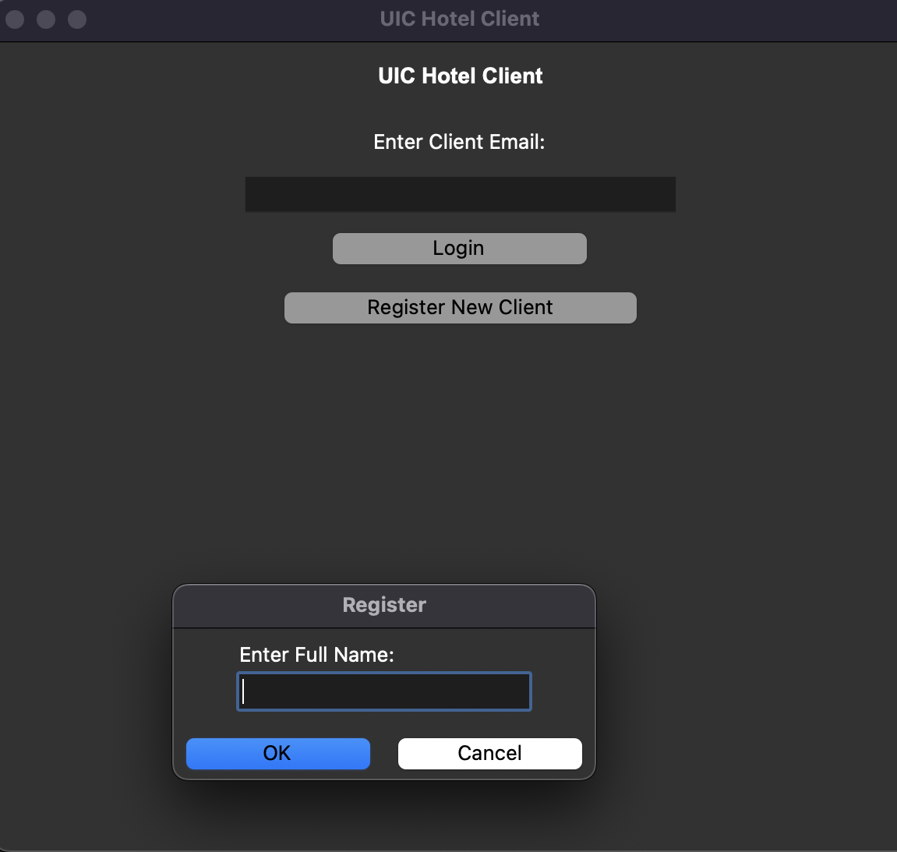
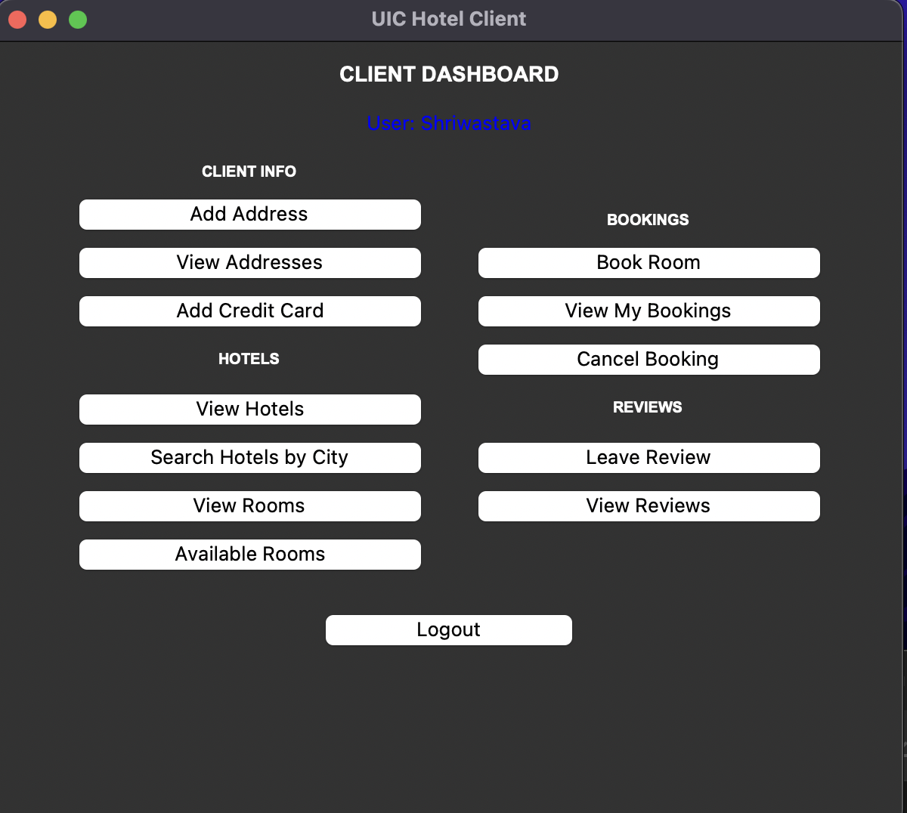
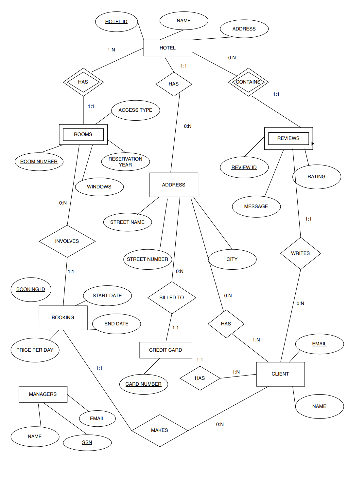

# Hotel Management System

A full-stack hotel management application built with Python and PostgreSQL,
featuring separate dashboards for clients and managers.

---

## What it does

Clients can register, search hotels by city, check room availability for
specific date ranges, make and cancel bookings, and leave reviews.
Managers can add and remove hotels and rooms, view booking statistics,
identify top clients, and generate spending reports.

---

## Screenshots

### Manager Login


### Manager Dashboard


### Client Registration


### Client Dashboard

---

## Stack

| Layer | Technology |
|---|---|
| Backend | Python, psycopg2 |
| Database | PostgreSQL |
| GUI | Tkinter |

---

## Schema



Key design decisions:
- GIST exclusion constraint prevents overlapping room bookings
- Reviews scoped per hotel with composite primary key
- Client addresses normalized into a separate table supporting multiple addresses per client

---

## How to Run

**Prerequisites:** Python 3, PostgreSQL

```bash
git clone https://github.com/shachi2511/hotel-management
cd hotel-management
pip install psycopg2-binary
```

Create a PostgreSQL database and run the schema:

```bash
psql -U postgres -c "CREATE DATABASE hotel_db"
psql -U postgres -d hotel_db -f hotel_schema.sql
```

Update `db.py` with your PostgreSQL credentials, then run:

```bash
# Manager dashboard
python manager_dashboard.py

# Client dashboard
python client_dashboard.py
```

---

## Features

- Conflict-free booking with date overlap prevention
- Top-K client ranking by number of bookings
- Problematic hotel detection based on ratings and out-of-city guests
- Client spending reports across all bookings
- Room availability search by city and date range